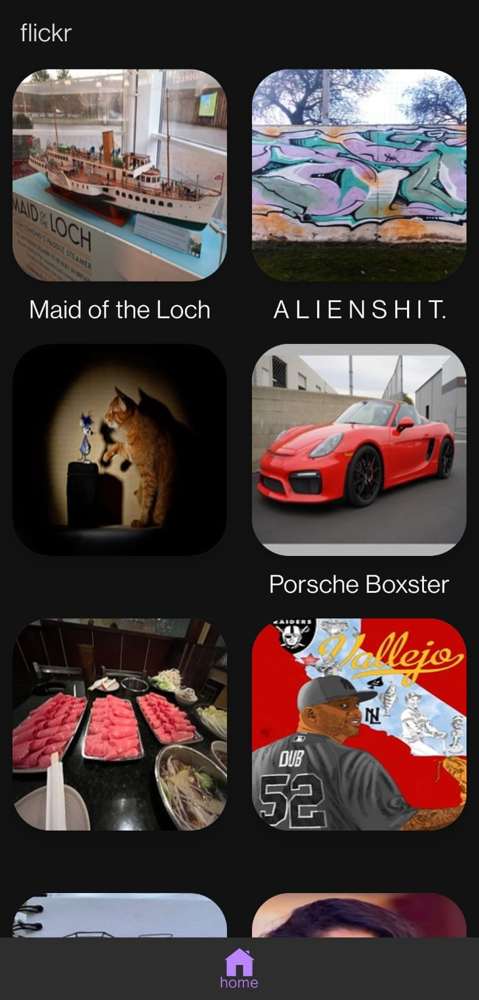

<h1 align="center">Gallery App</h1>

<b>It shows the images in recycler view uploaded on the flickr api
  </b>

 ## Tech and framework used

 * Retrofit
 * MVVM
 * Kotlin
 * RecyclerView
 * Coroutines

 ## API Used

 * FlickrAPI

 ## Screenshots

   
